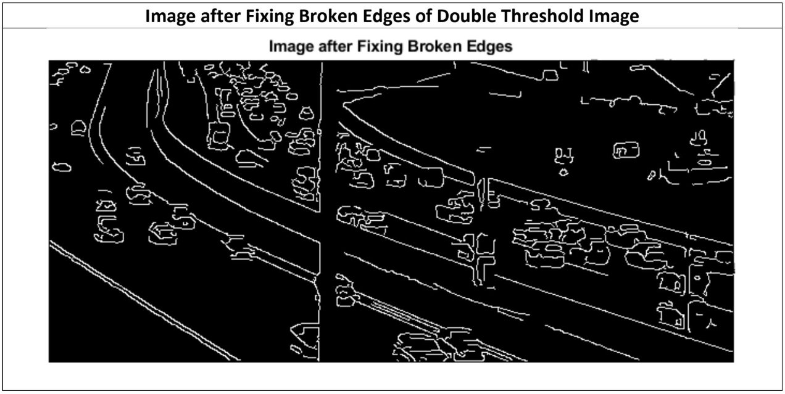
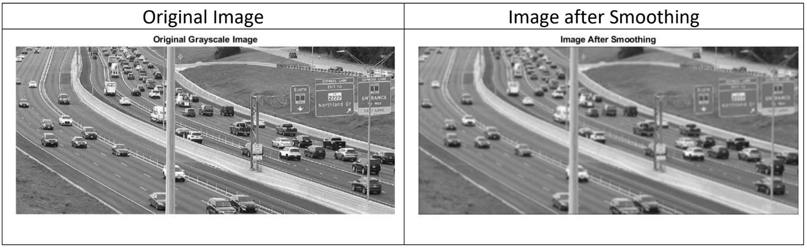
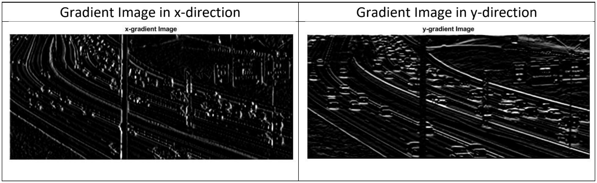
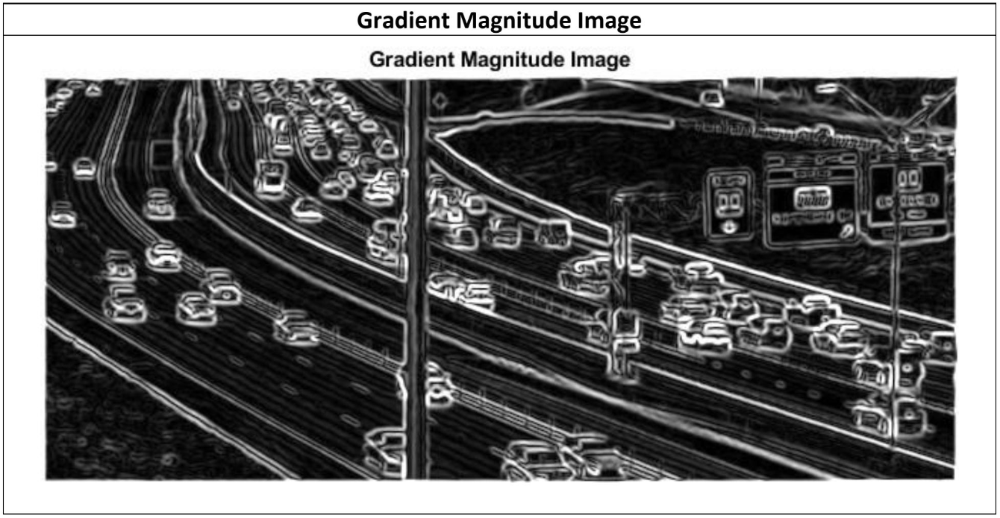
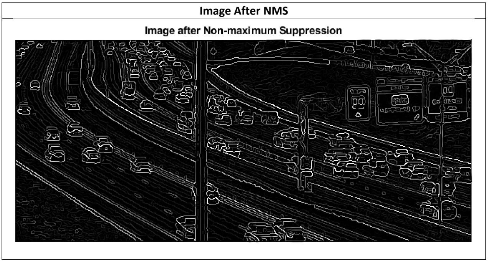
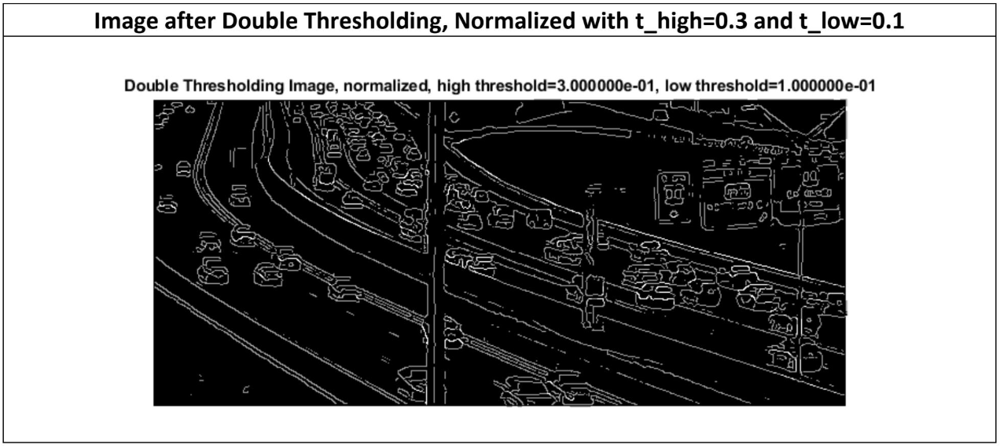

# Canny-Edge-Detection

<b>Canny edge detection</b> is an edge detection technique that uses a multi-stage algorithm. This technique is used to in image processing for edge detection with noise suppression.

### The algorithm includes:
1. #### Image Filtering to Smooth Image
2. #### Intensity Gradient Magnitude
3. #### Non Maximum Suppression
4. #### Double Thresholding
5. #### Connecting Strong Edges and Suppressing Weak Edges

## Input Image

## Output Image

## Image Processing in Each Stage

### 1. Image Filtering

### 2. Gradient Magnitude

### 3. Non Maximum Suppresion

### 4. Double Thresholding

### 5. Connecting Strong Edges and Suppressing Weak Edges

